# Sentient 🚀
> AI-Powered Stock Prediction & Market Sentiment Analysis Platform.


**Sentient** is a microservices-based application that forecasts stock prices 7 days into the future using Facebook Prophet and analyzes market sentiment using FinBERT. It is architected to run entirely on **Free Tier** infrastructure.

✨ Features
----------

*   **7-Day Price Forecast:** Uses additive regression models (Prophet) to predict future trends.
    
*   **AI Sentiment Analysis:** Scores news headlines from -1 (Bearish) to +1 (Bullish) using FinBERT.
    
*   **Smart Caching:** Implements "Cache-Aside" pattern with Turso DB to minimize API costs.
    
*   **Zero-Cost Architecture:** Runs on Vercel (Frontend), Render (Backend), and GitHub Actions (Automation).
    
*   **Automated Watchlist:** Headless "Morning Robot" checks your portfolio daily at 6:00 AM.

---

🛠 Tech Stack

| Component  | Technology | Version  | Description                                     |
| :--------- | :--------- | :------- | :---------------------------------------------- |
| Frontend   | Next.js    | 16.1.1   | React 19, Server Components, Tailwind CSS       |
| Backend    | FastAPI    |          | Python 3.14, Pydantic v2                        |
| ML Engine  | Prophet    | 1.1.5    | Time-series forecasting                         |
| NLP Engine | FinBERT    | ProsusAI | Financial Sentiment Analysis (via Hugging Face) |
| Database   | LibSQL     | Latest   | Distributed SQLite (Turso compatible)           |
| Container  | Docker     | 24+      | Containerization for local dev & Render         |


```graph LR
    subgraph "Validation Layer (Pydantic V2)"
    In[Input JSON] -->|model_validate| Request[StockRequest Model]
    end

    subgraph "Prediction Engine (Prophet 1.2)"
    Request -->|DataMapper| DF_Train[Train DataFrame (ds, y)]
    DF_Train -->|fit()| Model[Prophet 1.2 Model]
    Model -->|make_future_dataframe| DF_Future[Future DataFrame]
    DF_Future -->|predict()| Forecast[Forecast DataFrame]
    end

    subgraph "Output Layer"
    Forecast -->|Extract yhat_7d| Response[PredictionResponse Model]
    Response -->|model_dump| Out[JSON Response]
    end
```

## 🏗 Architecture

The system follows a **Microservices** pattern, separating the UI, Calculation Engine, and Persistence layers.

```mermaid
graph TD
    %% --- STYLING ---
    classDef frontend fill:#000000,stroke:#fff,stroke-width:2px,color:#fff;
    classDef backend fill:#2D3748,stroke:#4FD1C5,stroke-width:2px,color:#fff;
    classDef db fill:#2C5282,stroke:#fff,stroke-width:2px,color:#fff;
    classDef external fill:#E2E8F0,stroke:#2D3748,stroke-width:1px,color:#000;
    classDef automation fill:#9B2C2C,stroke:#F687B3,stroke-width:2px,color:#fff;

    %% --- ACTORS ---
    User((👤 User))

    %% --- FRONTEND (VERCEL) ---
    subgraph Client_Side ["Frontend Layer - Vercel"]
        NextJS[Next.js 16.1.1<br/>React 19 + ShadCN UI]:::frontend
    end

    %% --- BACKEND (RENDER) ---
    subgraph Server_Side ["Backend Layer - Render Docker"]
        FastAPI[FastAPI<br/>Python 3.14.2]:::backend
        Prophet[Facebook Prophet - Forecasting Engine]:::backend
        Cache[Sentiment Cache - Logic]:::backend
    end

    %% --- DATABASE (TURSO) ---
    subgraph Storage ["Persistence Layer - Turso"]
        Turso[(LibSQL / Turso<br/>Distributed SQLite)]:::db
    end

    %% --- AUTOMATION (GITHUB) ---
    subgraph Worker ["Automation Layer - GitHub Actions"]
        Action[Daily Cron Job<br/>6:00 AM UTC]:::automation
        Script[Headless Script<br/>Python 3.14]:::automation
    end

    %% --- EXTERNAL APIS ---
    subgraph External ["External APIs"]
        Yahoo[Yahoo Finance - yfinance]:::external
        HF[Hugging Face API - FinBERT Sentiment]:::external
        Gmail[Gmail SMTP - Email Alerts]:::external
    end

    %% --- CONNECTIONS ---
    User -->|HTTPS| NextJS
    NextJS -->|JSON / REST| FastAPI
    
    FastAPI -->|Read/Write| Turso
    FastAPI -->|Load Data| Prophet
    FastAPI -->|Fetch News| Yahoo
    FastAPI -->|Analyze Text| HF
    
    Action -->|Triggers| Script
    Script -->|Read Watchlist| Turso
    Script -->|Fetch Price| Yahoo
    Script -->|Send Alert| Gmail
```


## 📈 Scalability Roadmap (From MVP to Enterprise)

Sentient is built on a **Cloud-Agnostic Microservices Architecture**. While the current deployment utilizes free-tier services, the decoupled nature of the system allows individual components to be upgraded to paid enterprise infrastructure without rewriting the core codebase.

| Component | Current (Free Tier) | Upgrade Path (Paid/Enterprise) | Benefit of Upgrade |
| :--- | :--- | :--- | :--- |
| **Backend** | **Render (Free)**<br>*(Spins down after 15m idle)* | **AWS Fargate / Render Team**<br>*(Always-on Docker Containers)* | Eliminates 50s "Cold Start" latency; supports auto-scaling based on CPU load. |
| **Database** | **Turso (Starter)**<br>*(9B Reads/Month)* | **Turso (Scaler) / AWS RDS**<br>*(Dedicated IOPS)* | Dedicated compute resources; Point-in-time backups; Multi-region replication for global speed. |
| **AI Inference** | **Hugging Face API**<br>*(Rate Limited, Public Queue)* | **AWS SageMaker / Private Endpoints**<br>*(Dedicated GPU)* | Zero queue times; guarantees <100ms latency; ensures data privacy (inputs not shared with public API). |
| **Automation** | **GitHub Actions**<br>*(2,000 mins/month)* | **AWS Lambda + EventBridge**<br>*(Serverless Functions)* | Decouples automation from source control; allows for event-driven triggers (e.g., run prediction immediately when news breaks). |
| **Frontend** | **Vercel (Hobby)**<br>*(Bandwidth Limits)* | **Vercel Pro / AWS CloudFront**<br>*(Global Edge Cache)* | Enterprise SLA; DDOS protection; Multi-team collaboration features. |

### 🔄 Migration Strategy
1.  **Docker-First Design:** Since both Backend and Automation are containerized, moving from Render to AWS ECS or Kubernetes (EKS) requires only configuration changes, not code changes.
2.  **Database Abstraction:** The `db_handler.py` module uses an Adapter Pattern. Switching from SQLite/Turso to PostgreSQL requires changing only one driver dependency, not the business logic.
